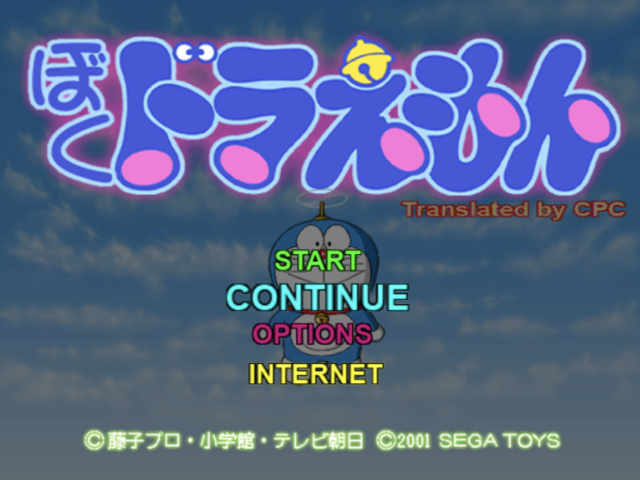
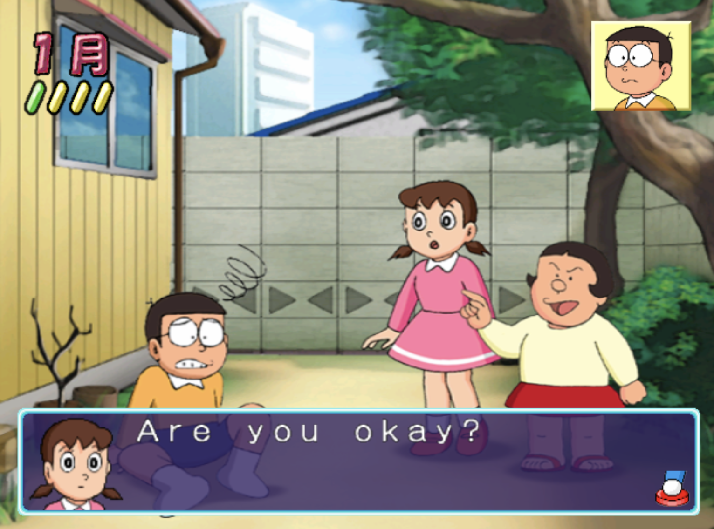
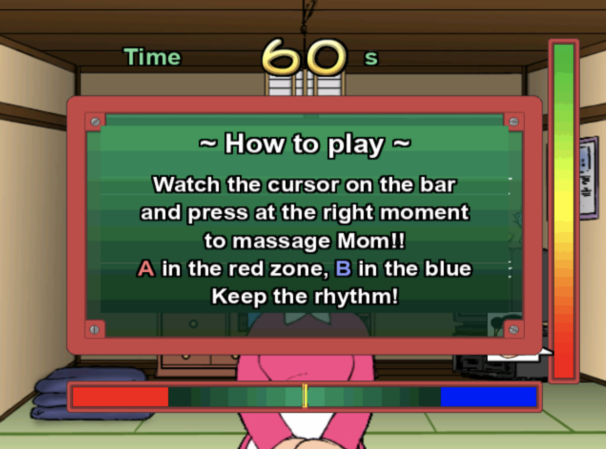

# Boku Doraemon (Japan): English

English patch for the Dreamcast game *Boku Doraemon* (Japan).

   

## Download

**Latest release:** [Boku Doraemon (Japan) [T-En by cpc v1.0]](https://github.com/consolesplayingconsoles/game-translations/releases/tag/boku-doraemon-japan-v1.0)

Patch file: [`Boku Doraemon (Japan) [T-En by cpc v1.0].dcp`](https://github.com/consolesplayingconsoles/game-translations/releases/download/boku-doraemon-japan-v1.0/Boku.Doraemon.Japan.T-En.by.cpc.v1.0.dcp)

Releases in this monorepo are namespaced per game, so the tag carries the game name (`boku-doraemon-japan-...`), not just a version.

## Applying the patch

Use [Universal Dreamcast Patcher](https://github.com/DerekPascarella/UniversalDreamcastPatcher/releases), the standard Dreamcast patching tool. It rebuilds a correct disc image from your own copy of the game, so it works across GDI, CUE+BIN, and CHD dumps.

You will need a GDI image of the original Japanese game with MD5 *dec050e5b1fa3231eb6d89938fd1089b*

1. Download the latest version for your OS.
2. Open the **Apply Patch** tab.
3. Select your source disc image (`.gdi`, `.cue`, or `.chd`).
4. Choose the `.dcp` patch file above.
5. Pick an output folder and format.
6. Click **Apply Patch**.

## Known issues

- **Map labels.** The labels on the map screen are still in Japanese.
- **Month sign.** The month sign (月) next to the date on the main screen stays in Japanese, as there is no room for a word there.

Neither affects gameplay.

## Feedback

Feedback from faster players than me is very welcome. Found a bug, a typo, or untranslated text? [Open an issue](https://github.com/consolesplayingconsoles/game-translations/issues/new). Note the scene or menu where it happens (a screenshot helps), and mention that it is the English Boku Doraemon patch.
