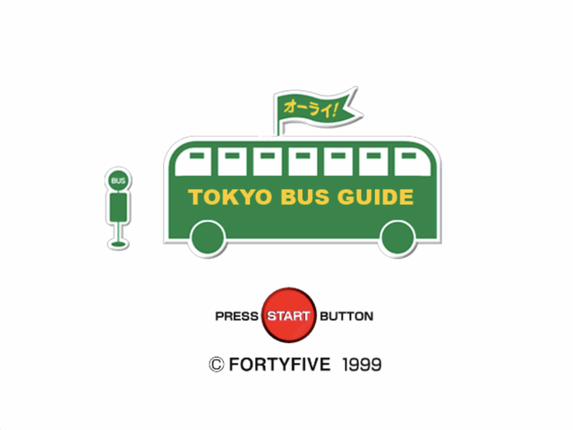
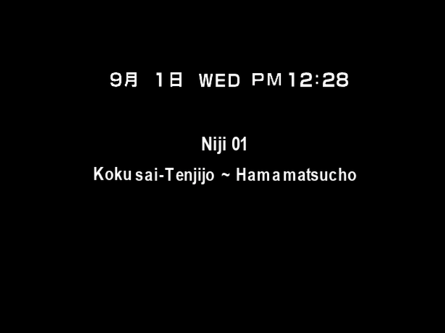
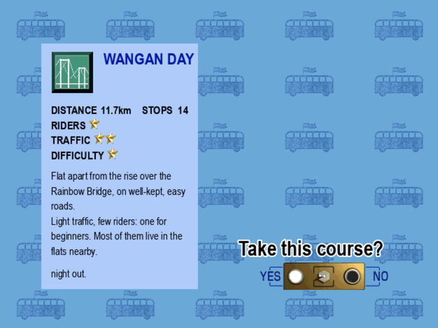
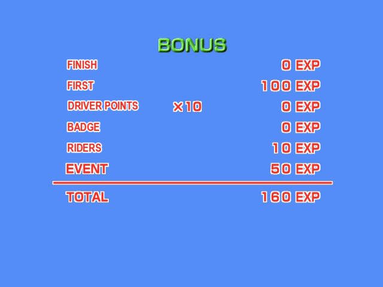

# Tokyo Bus Guide (Japan): English

English patch for the Dreamcast game *Tokyo Bus Guide* (東京バス案内), Fortyfive, 1999.

   

## Download

**Latest release:** [Tokyo Bus Guide (Japan) [T-En by cpc v1.0]](https://github.com/consolesplayingconsoles/game-translations/releases/tag/tokyo-bus-guide-japan-v1.0)

Patch file: `Tokyo Bus Guide (Japan) [T-En by cpc v1.0].dcp`

Releases in this monorepo are namespaced per game, so the tag carries the game name (`tokyo-bus-guide-japan-...`), not just a version.

## Applying the patch

Use [Universal Dreamcast Patcher](https://github.com/DerekPascarella/UniversalDreamcastPatcher/releases), the standard Dreamcast patching tool. It rebuilds a disc image from your own copy of the game, so it works across GDI, CUE+BIN and CHD dumps.

You need the original Japanese disc, **version V1.003** (data track MD5 *5fa322a0642ca5352ef733842148afe7*). The later **Rev A (V2.000)** pressing is a different disc and this patch does not apply to it.

1. Download the latest version for your OS.
2. Open the **Apply Patch** tab.
3. Select your source disc image (`.gdi`, `.cue` or `.chd`).
4. Choose the `.dcp` patch file above.
5. Pick an output folder and format (GDI if you are going to a GDEMU).
6. Click **Apply Patch**.

## What is translated

Menus, file select, save and VM screens, the story intro, the whole instructor script, the road sign quiz, the nine course cards, the route card before each run, the results table, and all 1,293 lines of passenger chat during a drive.

## Known issues

- **Date on the route card.** The 9月 1日 line is still Japanese: the month and day are separate sprites drawn between digit sprites.
- **The オーライ! flag** on the title screen is untouched.
- **Album, driver profile and practice screens**, and signage in the world, still carry Japanese graphics.
- **Lightly tested.** Played through the first course and the menus, no further. The passenger chat is translated in full but a line may read oddly in context.

## How it was made

The game is rebuilt from [lhsazevedo's Tokyo Bus Guide decompilation](https://github.com/lhsazevedo/tokyo-bus-guide-decomp), the first public decompilation of a Dreamcast game, rather than byte-patched, so English lines did not have to fit the Japanese ones they replace. Textures with baked-in text were repainted. Anything good here is downstream of that decompilation.

## Feedback

Found a bug, a typo, or untranslated text? [Open an issue](https://github.com/consolesplayingconsoles/game-translations/issues/new). Note the scene or menu where it happens (a screenshot helps), and mention that it is the English Tokyo Bus Guide patch.
